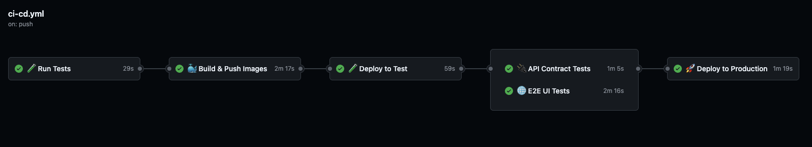

<div align="center">
  


# Todo App: Modern Web Application with Test-Driven Development

[](https://github.com/cemalocak/todo-app/actions)
[](https://codecov.io/gh/cemalocak/todo-app)
[](https://goreportcard.com/report/github.com/cemalocak/todo-app)

</div>

## Development Process with TDD

This project was developed using the principles of Test-Driven Development (TDD) and Acceptance Test-Driven Development (ATDD). The development process followed these steps:

1. **Acceptance Test Writing (Reject)**:
   - The user story is defined
   - End-to-end test is written
   - The test fails


2. **Unit Test Writing (Reject)**:
   - Required components are identified
   - Unit tests are written
   - Tests fail

3. **Minimal Coding (Green)**:
   - Write the minimum code that will pass the tests.
   - Tests will pass.


4. **Refactoring**:
   - Code quality is improved
   - Tests must still pass


5. **Repeat**:
   - The loop starts over for the new feature.

## CI/CD Pipeline

Our project uses a modern and automated CI/CD pipeline:



### Pipeline Stages

1. **🧪 Run Tests (29s)** 
   - Unit Tests 
   - Integration Tests 
   - Code Coverage

2. **🐳 Build & Push Images (2m 17s)** 
   - Multi-stage Docker builds 
   - Push to GitHub Container Registry 
   - Security scans

3. **🚀 Deploy to Test (59s)** 
   - Deploy to test environment 
   - Health checks 
   - Smoke tests

4. **🔍 API Contract Tests (1m 5s)** 
   - API contract validation 
   - Performance tests 
   - Security tests

5. **🌐 E2E UI Tests (2m 16s)** 
   - Playwright tests 
   - Cross-browser testing 
   - Visual regression tests

6. **📦 Deploy to Production (1m 19s)** 
   - Zero-downtime deployment 
   - Canary release 
   - Monitoring


### Build Commands
```bash
# Development
make dev              # Start development servers
make test             # Run all tests
make build            # Build Docker images
make up               # Start local containers

# Testing
make test-unit        # Run unit tests only
make test-int         # Run integration tests
make e2e-test         # Run E2E UI tests

# Deployment
make deploy-test      # Deploy to test environment
make deploy-prod      # Deploy to production
make aws-setup        # AWS EC2 setup guide
```

## Project Structure
```
todo-app/
├── cmd/server/          # Application entry point
├── internal/            # Private application code
│   ├── handler/         # HTTP handlers
│   ├── model/           # Data models
│   ├── repository/      # Data persistence layer
│   └── service/         # Business logic layer
├── test/                # Test files
│   ├── unit/            # Unit tests (split by functionality)
│   ├── integration/     # Integration tests
│   ├── contract/        # API contract tests
│   └── performance/     # Performance tests
├── tests/e2e/           # End-to-end tests (Playwright)
├── k8s/                 # Kubernetes manifests
├── web/                 # Frontend application
├── docs/                # Documentation
├── docker-compose.yml   # Development environment
├── docker-compose.prod.yml # Production environment
└── docker-stack.yml     # Docker Swarm stack
│   └── service/         # Business logic
├── pkg/config/          # Public configuration utilities
├── web/                 # Frontend assets
│   ├── static/          # CSS, JS files
│   └── templates/       # HTML templates
├── test/                # Test files
│   ├── integration/     # Integration tests
│   └── unit/           # Unit tests
├── docker/              # Docker configurations
└── .github/workflows/   # CI/CD pipelines
```


## Quick Start

```bash
# Clone the repo
git clone https://github.com/cemalocak/todo-app.git

# Go to the project directory
cd todo-app

# Start the development environment
make up

# Start the test environment
docker-compose -f docker-compose.test.yml up -d

# Run E2E tests
cd tests/e2e && npx playwright test
```

## Features

- ✨ Modern and responsive design
- 📱 Mobile-first approach
- 🔄 Real-time updates
- 🎯 CRUD operations
- 🧪 Comprehensive test coverage
- 🐳 Easy deployment with Docker
- 🚀 CI/CD pipeline integration

## Technology Stack

### Frontend
- React + Vite
- TailwindCSS
- Playwright (E2E Tests)

### Backend
- Go
- SQLite
- Go Test (Unit Tests)

### DevOps
- Docker + Docker Compose
- GitHub Actions
- AWS EC2


## Lisans

-

---

<div align="center">

**[API Reference](docs/API.md)** &nbsp;&nbsp;|&nbsp;&nbsp; 
**[Release Notes](docs/CHANGELOG.md)** &nbsp;&nbsp;|&nbsp;&nbsp;
**[AWS Deployment](docs/AWS_DEPLOYMENT_GUIDE.md)** 

*Built with ❤️ using Test-Driven Development*

</div> 