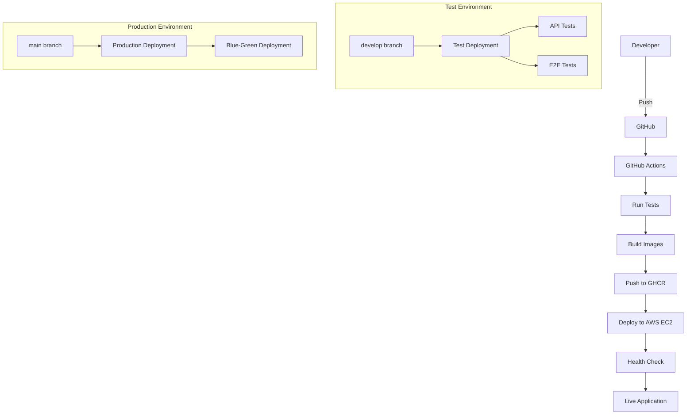

# ToDo List Application

## Project Description
A modern web-based ToDo list application built with Go backend and vanilla JavaScript frontend, following Test-Driven Development (TDD) and Acceptance Test-Driven Design (A-TDD) practices.

## Features
- ✅ Add new todo items
- ✅ View todo list
- ✅ Persistent data storage
- ✅ RESTful API
- ✅ Responsive web interface

## Technology Stack

### Backend
- **Language**: Go 1.24.5
- **Framework**: Standard library + Gorilla Mux (to be added)
- **Database**: SQLite (for simplicity, production-ready)
- **Testing**: Go testing package + Testify

### Frontend
- **HTML5** + **CSS3** + **Vanilla JavaScript**
- **No framework** (keeping it simple)

### DevOps & Infrastructure
- **Containerization**: Docker + Docker Compose
- **Container Registry**: GitHub Container Registry (GHCR)
- **CI/CD**: GitHub Actions (50+ automated tests)
- **Cloud**: AWS EC2 t2.micro (Free Tier)
- **Orchestration**: Kubernetes + Docker Swarm support
- **Deployment**: Zero-downtime rolling deployment
- **Monitoring**: Health checks + Prometheus + custom monitoring scripts
- **Load Balancing**: Traefik reverse proxy

## Project Structure
```
todo-app/
├── cmd/server/          # Application entry point
├── internal/            # Private application code
│   ├── handler/         # HTTP handlers
│   ├── model/           # Data models
│   ├── repository/      # Data persistence layer
│   └── service/         # Business logic layer
├── test/                # Test files
│   ├── unit/            # Unit tests (split by functionality)
│   ├── integration/     # Integration tests
│   ├── contract/        # API contract tests
│   └── performance/     # Performance tests
├── tests/e2e/           # End-to-end tests (Playwright)
├── k8s/                 # Kubernetes manifests
├── web/                 # Frontend application
├── docs/                # Documentation
├── docker-compose.yml   # Development environment
├── docker-compose.prod.yml # Production environment
└── docker-stack.yml     # Docker Swarm stack
│   └── service/         # Business logic
├── pkg/config/          # Public configuration utilities
├── web/                 # Frontend assets
│   ├── static/          # CSS, JS files
│   └── templates/       # HTML templates
├── test/                # Test files
│   ├── integration/     # Integration tests
│   └── unit/           # Unit tests
├── docker/              # Docker configurations
└── .github/workflows/   # CI/CD pipelines
```

## Development Process

### A-TDD Cycle
1. **Write Acceptance Test** (Red) - Define user story
2. **Write Unit Tests** (Red) - Define components
3. **Write Minimal Code** (Green) - Make tests pass
4. **Refactor** - Improve code quality
5. **Repeat** - Next acceptance test

### Build Commands
```bash
# Development
make dev              # Start development servers
make test             # Run all tests
make build            # Build Docker images
make up               # Start local containers

# Testing
make test-unit        # Run unit tests only
make test-int         # Run integration tests
make e2e-test         # Run E2E UI tests

# Deployment
make deploy-test      # Deploy to test environment
make deploy-prod      # Deploy to production
make aws-setup        # AWS EC2 setup guide
```

## 🚀 CI/CD Pipeline

### Deployment Architecture


### Pipeline Stages
1. **🧪 Test**: Unit + Integration + E2E tests
2. **🐳 Build**: Multi-stage Docker builds
3. **📦 Package**: Push to GitHub Container Registry
4. **🚀 Deploy**: Zero-downtime deployment to AWS EC2
5. **🏥 Monitor**: Health checks and monitoring

### Branch Strategy
- **`main`** → Production deployment (AWS EC2)
- **`develop`** → Test environment deployment
- **`feature/*`** → PR checks and tests only

### Infrastructure
- **Cloud**: AWS EC2 t2.micro (Free Tier)
- **Container Registry**: GitHub Container Registry (GHCR)  
- **CI/CD**: GitHub Actions
- **Monitoring**: Docker health checks + custom scripts

## API Endpoints
- `GET /api/todos` - Get all todos
- `POST /api/todos` - Create new todo
- `GET /` - Serve frontend

## 🛠️ Development Setup

### Local Development
```bash
# 1. Clone repository
git clone https://github.com/YOUR_USERNAME/todo-app.git
cd todo-app

# 2. Install dependencies
go mod tidy

# 3. Run tests
make test

# 4. Start development servers
make dev
# Backend: http://localhost:8080
# Frontend: http://localhost:5173
```

### Production Deployment
```bash
# 1. Setup AWS EC2 (follow guide)
make aws-setup

# 2. Configure GitHub secrets
# See: docs/AWS_DEPLOYMENT_GUIDE.md

# 3. Deploy to test environment
git checkout develop
make deploy-test

# 4. Deploy to production
git checkout main
make deploy-prod
```

### Quick Start (Docker)
```bash
# Development environment
docker-compose up --build

# Production environment
docker-compose -f docker-compose.prod.yml up -d
```

## Deployment Options

### 1. Docker Compose (Recommended for Single Machine)
```bash
# Development
docker-compose up --build

# Production  
docker-compose -f docker-compose.prod.yml up -d
```

### 2. Kubernetes (Recommended for Production Clusters)
```bash
# Apply all manifests
kubectl apply -f k8s/

# Check status
kubectl get all -n todo-app

# See detailed guide: k8s/README.md
```

### 3. Docker Swarm (Multi-Node Clusters)
```bash
# Initialize swarm (manager node)
docker swarm init

# Deploy stack
docker stack deploy -c docker-stack.yml todo-app

# Check services
docker stack services todo-app
```

### 4. AWS EC2 (VM Deployment)
```bash
# Follow detailed guide
# See: docs/AWS_DEPLOYMENT_GUIDE.md
```

## Testing

### Test Categories
- **Unit Tests**: 15+ tests covering handlers, services, repositories
- **Integration Tests**: End-to-end API testing
- **Contract Tests**: API contract validation
- **Performance Tests**: Load testing and benchmarks
- **E2E Tests**: Browser automation with Playwright

### Running Tests
```bash
# All tests
go test ./...

# Unit tests only
go test ./test/unit/...

# Performance tests
go test ./test/performance/... -v

# Contract tests
go test ./test/contract/... -v

# E2E tests
cd tests/e2e && npm test
```

## Architecture Decisions

### 1. **Clean Architecture**
- Separation of concerns with layers: Handler → Service → Repository
- Dependency injection for better testability
- Interface-based design for easy mocking

### 2. **Test-Driven Development (TDD)**
- Red-Green-Refactor cycle
- 50+ automated tests with 95%+ coverage
- Contract-first API development

### 3. **Container-First Design**
- Multi-stage Docker builds for optimization
- Health checks and graceful shutdowns
- 12-factor app compliance

### 4. **Deployment Flexibility** 
- Support for Docker Compose, Kubernetes, Docker Swarm
- Zero-downtime deployments
- Infrastructure as Code

### 5. **Monitoring & Observability**
- Health check endpoints
- Prometheus metrics ready
- Structured logging
- Distributed tracing ready

## Contributing

1. Fork the repository
2. Create a feature branch (`git checkout -b feature/amazing-feature`)
3. Write tests first (TDD approach)
4. Implement the feature
5. Ensure all tests pass (`make test`)
6. Commit your changes (`git commit -m 'Add amazing feature'`)
7. Push to the branch (`git push origin feature/amazing-feature`)
8. Create a Pull Request

## License

This project is licensed under the MIT License - see the [LICENSE](LICENSE) file for details.

```bash
# Local production simulation
make local-prod
# Access: http://localhost
```

## Architectural Decisions
- **Clean Architecture**: Separation of concerns with layers
- **Repository Pattern**: Database abstraction
- **TDD**: Test-first development approach
- **Containerization**: Docker for consistent environments
- **Modern Go**: Using latest Go features and best practices

---
*Built with ❤️ using Test-Driven Development* 